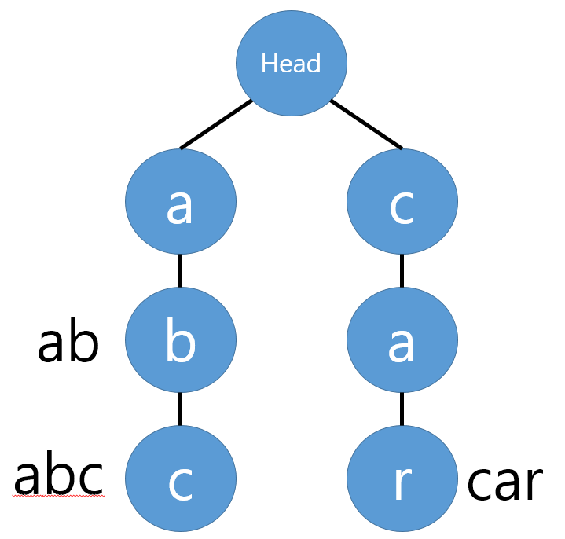

# 📦 Trie_Concept

## 📌 Trie란?


Trie(트라이)는 문자열을 **효율적으로 저장하고 탐색**하기 위한 트리 형태의 자료구조다.  
Prefix Tree, Radix Tree, Retrieval Tree 등으로도 불리며, retrieval(탐색)에서 이름이 유래됐다.

주요 활용:

- 자동완성 (검색창, IDE)
- 사전(Dictionary) 검색
- 접두사 기반 문제 풀이

예:

- 'Datastructure'를 검색할 땐 D → a → t → a … 순으로 문자 단위로 찾아간다.
- 이런 **문자별 경로 탐색 방식**이 Trie의 핵심 아이디어다.

---

## 🧩 Trie의 기본 구조



| 구성 요소 | 설명                                                          |
| --------- | ------------------------------------------------------------- |
| Node      | key(문자), data(끝나는 문자열 표시), children(자식 노드 dict) |
| Head Node | root 역할, key는 None, 시작점                                 |

---

## ⚙️ 예제 삽입 과정

단어들: `'abc'`, `'ab'`, `'car'`

```
[ROOT]
 ├─ a ─ b ─ c (data=abc)
 └─ c ─ a ─ r (data=car)
```

.png>)

- `'abc'` 삽입: a → b → c, c 노드 data에 'abc' 표시

.png>)

- `'ab'` 삽입: a → b, b 노드 data에 'ab' 표시

.png>)

- `'car'` 삽입: c → a → r, r 노드 data에 'car' 표시

---

## 🔑 Trie의 장점과 단점

✅ 장점

- O(L) 탐색 (L = 문자열 길이)
- 공통 prefix 공유로 일부 공간 절약
- 자동완성, 사전 검색에 강함

❌ 단점

- 각 노드가 알파벳 수만큼 자식 포인터(메모리) 필요 → 메모리 낭비
- 문자열 수가 적거나 prefix 공유가 적으면 비효율

---

## 🛠️ Python 구현

```python
class Trie(object):
    def **init**(self):
    self.head = Node(None)

    # 문자열 삽입
    def insert(self, string):
        curr_node = self.head

        # 삽입할 String 각각의 문자에 대해 자식Node를 만들며 내려간다.
        for char in string:
            # 자식Node들 중 같은 문자가 없으면 Node 새로 생성
            if char not in curr_node.children:
                curr_node.children[char] = Node(char)

            # 같음 문자가 있으면 노드를 따로 생성하지 않고, 해당 노드로 이동
            curr_node = curr_node.children[char]

            # Case 1: 탐색 중 종료된 문자열 있음
            if curr_node.data :
                return False

        # Case 2: 현재 문자열 삽입 완료 시점인데 자식이 존재함
        if curr_node.children:
            return False

        # 문자열이 끝난 지점의 노드의 data값에 해당 문자열을 표시
        curr_node.data = string
        return True


    # 문자열이 존재하는지 탐색!
    def search(self, string):
        curr_node = self.head

        for char in string:
            if char in curr_node.children:
                curr_node = curr_node.children[char]
            else:
                return False

        # 탐색이 끝난 후에 해당 노드의 data값이 존재한다면
        # 문자가 포함되어있다는 뜻이다!
        if curr_node.data is not None:
            return True

```

## Reference

- https://velog.io/@kimdukbae/%EC%9E%90%EB%A3%8C%EA%B5%AC%EC%A1%B0-%ED%8A%B8%EB%9D%BC%EC%9D%B4-Trie
